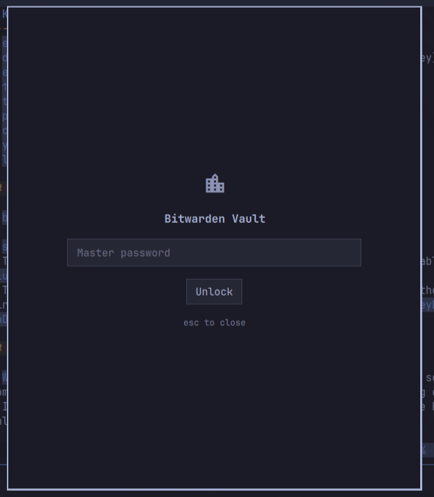
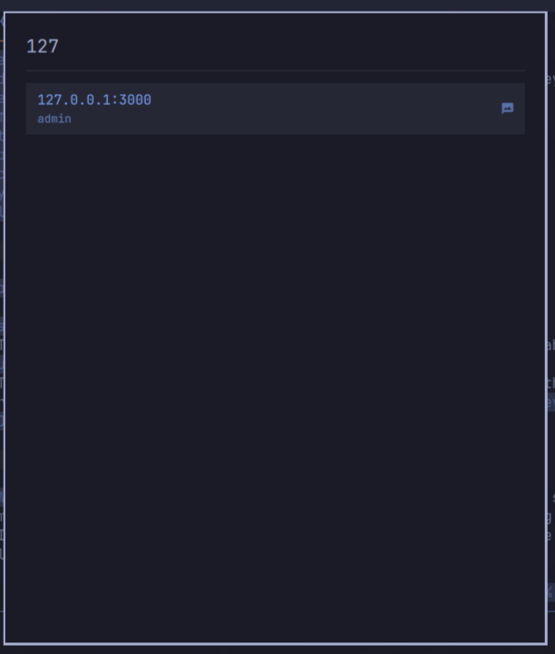

# BW Vault

A Bitwarden vault for [Omarchy](https://omarchy.org/), powered by the official [`bw`](https://github.com/bitwarden/cli) CLI. Two ways in:

- a **bar dropdown** for when you want one password and you're already looking at the field you'll paste it into, and
- a **fullscreen overlay** for unlocking, browsing, revealing and everything else.

Both are views onto one shared session, so neither pays for the other. Rewritten in Quickshell/QML from the [bw-tui](https://github.com/keboy/bw-tui) Bubble Tea TUI.

## Why it's split this way

`bw` is a Node program, and a cold start costs about four seconds. In 1.0 the overlay owned the session, so closing it dropped the item list and the next open paid that again. A dropdown you summon for one password cannot afford it.

So the session, the item list and every `bw` child now live in a service the shell mounts once. Opening the dropdown against a warm list costs nothing measurable — filtering 215 items is well under a tenth of a second, because no `bw` runs at all. What that caching does and does not cover is spelled out in [Security notes](#security-notes); the short version is that item *metadata* now outlives the panel and passwords still never do.

## Screenshots

Unlock screen · searchable vault list:





## Features

- **API key authentication** — authenticates with your [personal API key](https://bitwarden.com/help/personal-api-key/) (`bw login --apikey`) using `BW_CLIENTID`/`BW_CLIENTSECRET` in the child process environment, never argv. The API key is an alternative auth path that doesn't require interactive 2FA at login time and bypasses the new-device verification prompt.
- **Unlock screen** — client_id + client_secret on first login (then kept in the OS keyring), master password each time; once authenticated, only the master password is needed. The master password travels through the child process environment (`bw --passwordenv`), never argv.
- **Floating unlock card** — while the API key is still needed, the overlay shrinks to a small card you can drag out of the way, and it stops grabbing the keyboard, so you can copy the key from your browser and paste it back without closing the overlay.
- **Bar dropdown** — lock state in the bar; click for a search box over your vault. Enter copies the password, `ctrl+u` copies the username without running `bw` at all. Right-click the bar icon to lock.
- **Searchable item list** — type to filter, arrow keys / `j` `k` to move, Enter to open.
- **Item detail** — reveal password (`p`), copy username (`c`), copy password (`y`) via `wl-copy`.
- **Session persistence** — the session key is mirrored to the OS keyring (Secret Service via `secret-tool`), so the master password is asked for once per machine when the keyring is available.
- **Lock** — `l` locks the vault, clears the stored session, and drops the cached item list.
- **Idle cache expiry** — the cached list is forgotten after `cacheTtlMinutes` of no vault activity (15 by default). The session is untouched, so the next open costs one `bw list` and no master password.
- **Native Omarchy theming** — built on `BorderSurface`, `Button`, `TextField`, and `Color.menu.*` tokens, so it matches your theme.

### Scope

This is a quick-access overlay, not a full vault manager. It reads and copies items only — it doesn't create, edit, or delete items, and it doesn't cover attachments, organizations/collections, or multiple accounts. Use the official apps for those.

## Setup: personal API key

1. In the Bitwarden web app, go to **Settings → Security → Keys**.
2. Select **View API key** and enter your master password.
3. Note the `client_id` (format `user.xxxx`) and `client_secret`.
4. Enter them in the overlay's unlock screen the first time you log in. They are passed to `bw login --apikey` via the process environment and then stored in your OS keyring.

### Stored in your OS keyring

The overlay keeps the personal API key in the OS keyring (the same Secret Service entry your session uses). You paste the `client_id` / `client_secret` into the unlock screen when you first set it up — and again if you rotate the key in the Bitwarden web app. On every other open the overlay pre-fills them from the keyring and only asks for the master password; a rotated key is stored the next time you log in.

## Requirements

- Omarchy (Quickshell-based shell)
- A `wlr-layer-shell`-compatible Wayland compositor (Omarchy's Hyprland, Sway, etc.) — not X11
- [Bitwarden CLI](https://bitwarden.com/help/bitwarden-cli/) (`bw`)
- `wl-clipboard` (`wl-copy`, `wl-paste`)
- `libsecret` (`secret-tool`) — session and API key persistence

```sh
# Arch / Omarchy
sudo pacman -S bitwarden-cli wl-clipboard libsecret
```

## Install

```sh
omarchy plugin add https://github.com/alkevintan/bw-vault.git --enable
```

Or without enabling right away:

```sh
omarchy plugin add https://github.com/alkevintan/bw-vault.git
omarchy plugin enable com.aktivesolutions.bw-vault
```

## Usage

Summon the overlay from a keybinding. Add to `~/.config/hypr/bindings.lua`:

```lua
o.bind("SUPER + B", "Bitwarden vault", "omarchy-shell shell toggle com.aktivesolutions.bw-vault")
```

You can also summon it ad hoc:

```sh
omarchy-shell shell toggle com.aktivesolutions.bw-vault
```

### The bar dropdown

Enabling the plugin puts a padlock in your bar: **left click** opens the dropdown, **middle click** opens the full overlay, **right click** locks the vault.

It has its own IPC target, so it can have its own keybinding, separate from the overlay:

```lua
o.bind("SUPER + SHIFT + B", "Vault quick copy", "omarchy-shell bw-vault-bar toggle")
```

and it can be opened with the search line already filled in — useful from a script, or a per-site keybinding:

```sh
omarchy-shell bw-vault-bar search github
```

`search` only filters metadata that is already in the shell process. Nothing in the IPC surface reads, fetches or copies a secret: a password always costs a keystroke on a panel someone is looking at.

| Key | Action |
|-----|--------|
| `type` | Filter items |
| `↑` `↓` | Move through results |
| `enter` | Copy the password (one `bw get`, so about four seconds — the panel says it's fetching) |
| `ctrl+u` | Copy the username (instant; it's already in the cached metadata) |
| `ctrl+l` | Lock the vault |
| `ctrl+o` | Hand off to the full overlay |
| `esc` | Close |

Clicking a row copies its password; right-clicking a row copies its username.

### Bar widget settings

Set these through Omarchy's bar widget settings, or directly on the widget's `shell.json` entry.

| Setting | Default | What |
|---|---|---|
| `maxResults` | `8` | Rows shown in the dropdown |
| `cacheTtlMinutes` | `15` | Forget the cached item list after this many idle minutes. `0` keeps it until you lock |
| `lockOnRightClick` | `true` | Right-clicking the bar icon locks the vault |
| `showCount` | `false` | Show the item count next to the bar icon |

### Overlay keys

| Key | Action |
|-----|--------|
| `esc` | Close (or back / clear filter) |
| `drag card` | Move the floating unlock card (while entering the API key) |
| `enter` | Open item / unlock |
| `↑` `↓` / `j` `k` | Move through list |
| `type` | Filter items |
| `p` | Reveal password |
| `c` | Copy username |
| `y` | Copy password |
| `l` | Lock vault |

## Troubleshooting

- `bw: command not found` → install the [Bitwarden CLI](https://bitwarden.com/help/bitwarden-cli/).
- `secret-tool: command not found` → install `libsecret`.
- The overlay doesn't appear when summoned → confirm the plugin is enabled: `omarchy plugin list`.
- The floating card won't take a paste from the browser → click into the card's field first; if the compositor still keeps keyboard focus on the card (`WlrKeyboardFocus.OnDemand` quirk), close and reopen the overlay.

## Known issues

- `WlrKeyboardFocus.OnDemand` can occasionally retain keyboard focus on some compositors, so the browser may not take keystrokes while the floating card is open.
- If the OS keyring daemon is not running, the session and API key are held in memory only and lost when the shell restarts.

## Remove

```sh
omarchy plugin disable com.aktivesolutions.bw-vault
omarchy plugin remove com.aktivesolutions.bw-vault
```

## Security notes

- The client_id and client_secret are passed to `bw login --apikey` via the child process environment and stored in your OS keyring via `secret-tool`, never in a plaintext file in your home directory. The master password only ever lives in the child process environment (`BW_VAULT_MASTER_PASSWORD`), never argv or a file.
- Item passwords are fetched on demand (`bw get item <id>`). The password is handed to the view that asked for it through a signal and is never assigned to a property on the shared service; the overlay holds it only while its detail screen is open, and the dropdown only long enough to put it on the clipboard.
- **Item metadata is cached between opens, and that is a real change from 1.0.** `parseList()` strips passwords out of `bw list` output before anything reaches a property, so what the service holds is names, usernames, ids and URIs — a map of your vault, not its contents. It lives in the always-loaded shell process until you lock or until `cacheTtlMinutes` of idleness passes. In 1.0 this was dropped every time the overlay closed. If you would rather have the old behaviour back at the cost of a four-second wait per open, set `cacheTtlMinutes` low; the session itself is unaffected either way.
- Credentials handed to `bw login` / `bw unlock` travel through the child's environment and that environment is cleared when the child exits, on both the success and failure paths. Before 1.1 the master password stayed set on the Process until the next unlock overwrote it.
- A `bw list` started before a lock cannot repopulate the cache after it: in-flight children carry the generation they started in and drop their results if it has moved.
- The session key is stored in the OS keyring via `secret-tool`. If that fails, the session is held in memory only.
- This plugin runs unsandboxed in your shell process, like all Omarchy plugins. It has access to your session and can run arbitrary commands. Review the source before trusting it.

## Development

```sh
omarchy plugin validate .        # check the manifest
omarchy-shell shell toggle com.aktivesolutions.bw-vault   # summon for a live test
```

Plugin structure:

```
manifest.json      # plugin manifest (id: com.aktivesolutions.bw-vault)
Service.qml        # session, item metadata, every bw child. Mounted once by the shell
Vault.qml          # fullscreen overlay: unlock, browse, detail. A view over Service
BarWidget.qml      # bar icon + dropdown: search and copy. A view over Service
VaultModel.js      # bw CLI command building + JSON parsing (pure JS)
```

Live state, without secrets in it:

```sh
omarchy-shell com.aktivesolutions.bw-vault state   # the service
omarchy-shell bw-vault state                       # the overlay
omarchy-shell bw-vault-bar status                  # the dropdown
```

Three Omarchy quirks that will cost you an hour if you meet them cold:

- A **new** `.qml` file in a plugin directory fails to load with `File name case mismatch` until the shell restarts — the QML engine caches the directory listing at startup. Hot-reload only covers files that already existed.
- A **new** `ipcTarget` also needs a shell restart to register, and after a hot-reload the *stale* instance keeps the old target: you get `Handler was registered but will not be used`, and IPC calls land on a widget that is no longer on screen.
- `omarchy plugin enable --section right` silently does nothing if the plugin already has a `plugins[]` entry in `shell.json`. It prints "Enabled and moved" and writes no change. Remove the `plugins[]` entry first — a `bar.layout` entry keeps the overlay and service enabled on its own.

After editing, `omarchy restart shell` rather than trusting hot-reload.

## License

MIT — see [LICENSE](LICENSE).
