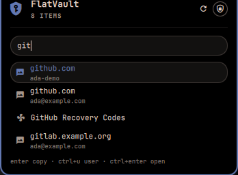
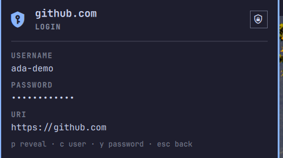
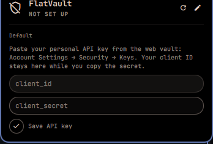

# FlatVault

FlatVault puts your Bitwarden vault in the [Omarchy](https://omarchy.org/) bar, powered by the official [`bw`](https://github.com/bitwarden/cli) CLI. Click the bar icon, type a few letters, press enter — the password is on your clipboard and you never left the window you're pasting into.

The plugin ID, CLI commands and state paths keep their `bw-vault` names so existing installations retain their connections, keyring entries and offline snapshots.

Rewritten in Quickshell/QML from the [bw-tui](https://github.com/keboy/bw-tui) Bubble Tea TUI.



 

*Screenshots are of the fixture vault in `test/`, not a real one — see [Development](#development).*

## How it's put together

`bw` is a Node program and a cold start can cost several seconds. That number shapes everything here.

The session, the item list and every `bw` child live in a **service** the shell mounts once and keeps. The dropdown is a view onto it. Opening the dropdown against a warm list costs nothing measurable. A successful list refresh also writes an encrypted snapshot. Opening or copying one of those items reads the snapshot without starting `bw` again. Current one-time codes still come from `bw` on demand.

What that caching does and does not cover is spelled out in [Security notes](#security-notes). The long-lived QML service keeps only item metadata. An encrypted disk snapshot also holds passwords for offline use; one-time codes are never saved.

## Features

- **Bar dropdown** — lock state at a glance; click for a search box over your vault. Entries with TOTP show their current code beside the name while the list is open. Enter copies the password. `ctrl+u` copies the username with no `bw` call at all, because the username is already in the cached list.
- **Item detail** — `ctrl+enter` opens the selected item: username, password (hidden until you press `p`), current TOTP code when configured, URI, and notes.
- **Master-password unlock** — in the dropdown. The password travels through the child process environment (`bw --passwordenv`), never argv, and its environment is cleared when the child exits.
- **API key authentication** — authenticates with your [personal API key](https://bitwarden.com/help/personal-api-key/) (`bw login --apikey`). Enter the key in the dropdown once per connection; `bw` remains an internal dependency, with no terminal setup required.
- **Session persistence** — the session key is mirrored to the OS keyring (Secret Service via `secret-tool`), so the master password is asked for once per machine and survives a shell restart.
- **Idle cache expiry** — the cached list is forgotten after `cacheTtlMinutes` of no vault activity (15 by default). The session is untouched, so recovering costs one `bw list` and no master password.
- **Offline copy** — a successful online list refresh writes an encrypted snapshot with passwords to local state. If the server is unreachable, the dropdown can search and copy from that snapshot while the desktop keyring is unlocked. One-time codes require the live CLI.
- **Fast item detail** — after a successful list refresh, passwords and notes are decrypted from that snapshot only when requested. If the snapshot is unavailable, the helper falls back to `bw get`. The refresh icon in the list updates the vault and snapshot after changes made elsewhere.
- **Multiple endpoints** — each added server has its own CLI data directory, session, API key and encrypted snapshot. Manage them with `bw-vault-endpoints`.
- **Clipboard protection** — credential copies use Wayland's sensitive-data hint and are wiped about 20 seconds later, but only if the clipboard still holds the value this plugin copied.
- **Native Omarchy theming** — built on `Panel`, `KeyboardPanel`, `TextField` and `Color.*` tokens, so it matches your theme.

### Scope

Read and copy only. It does not create, edit or delete items, and it does not cover attachments, organizations/collections, or multiple accounts. Use the official apps for those.

## Install

```sh
omarchy plugin add https://github.com/flathack/bw-vault.git --enable
```

`--enable` puts the padlock in your bar and asks which section. Without it, run `omarchy plugin enable com.aktivesolutions.bw-vault --section right` afterwards.

For an install pinned to the reviewed 2.2.0 release, add it without enabling,
detach the clone at the immutable release tag, then enable it:

```sh
omarchy plugin add https://github.com/flathack/bw-vault.git
git -C ~/.config/omarchy/plugins/com.aktivesolutions.bw-vault checkout --detach v2.2.0
omarchy plugin enable com.aktivesolutions.bw-vault --section right
```

`omarchy plugin update` returns to the repository's moving default branch and
therefore requires a fresh review.

> If the plugin already has a `plugins[]` entry in `shell.json` from an earlier version, `omarchy plugin enable --section right` will report "Enabled and moved" and change nothing. Remove that entry first; the `bar.layout` entry keeps the service enabled on its own.

## Setup

Open the vault dropdown. If the selected connection has no API key, paste its `client_id` and `client_secret` from the web vault (Account Settings → Security → Keys → View API Key), then press the checkmark to save them in the OS keyring. Paste the client ID first; the dropdown may close while you switch to the browser for the secret, but the ID remains in the field when you reopen it. The secret field is cleared whenever the dropdown closes. Then enter your master password to unlock.

If you prefer terminal setup, the existing command is still available:

```sh
~/.config/omarchy/plugins/com.aktivesolutions.bw-vault/bin/bw-vault-setup
```

It prompts for `client_id` and `client_secret` and writes them to the same OS keyring entries. The secret is read with terminal echo off and piped to `secret-tool` on stdin.

`--show` reports whether a key is stored without printing the secret; `--clear` removes it.

The plugin stores the key through the short-lived helper; neither field goes on a process command line. The client secret is cleared from the form after saving or closing. The client ID is retained across closes until setup succeeds.

If `bw` is already logged in by some other means, you can skip this entirely: the dropdown will ask for your master password and unlock against the existing login.

### Multiple vault servers

The existing CLI account remains the `default` endpoint. For another server:

```sh
~/.config/omarchy/plugins/com.aktivesolutions.bw-vault/bin/bw-vault-endpoints add NAS https://vault.example.com
omarchy restart shell
```

In the unlock screen, click the small pencil beside the vault status to open **Connections**. There you can select, add, edit or remove a server. Removing an added server takes two clicks. Editing the original `default` connection moves FlatVault to its own CLI data directory; your global Bitwarden CLI configuration keeps its old address. Changing a server URL clears that connection's plugin session, API key and offline copy, so set up its API key again before unlocking.

The terminal command remains available: `bw-vault-endpoints list` shows IDs and marks the selected one with `*`; `select ID`, `update ID NAME URL`, and `remove ID` manage entries. After terminal changes, restart the shell so the service drops the old in-memory vault. The `default` endpoint cannot be removed. Removal deletes an added endpoint's managed CLI data, encrypted snapshot and keyring entries. `bw-vault-setup --show` and `--clear` act on the selected endpoint.

The offline copy is created after a successful online list. It is encrypted with a random key stored in Secret Service and saved under `$XDG_STATE_HOME/bw-vault` (or `~/.local/state/bw-vault`). It is available only while that keyring is unlocked. The snapshot contains passwords and notes; remove an endpoint to delete its snapshot. The default endpoint's snapshot can be deleted manually from that directory. TOTP codes are unavailable offline.

## Usage

Bind the dropdown in `~/.config/hypr/bindings.lua`:

```lua
o.bind("SUPER + B", "FlatVault", "omarchy-shell bw-vault-bar toggle")
```

Or click the shield in the bar. **Right-clicking** it locks the vault.

Locking is worth its own binding too — `ctrl+l` inside the dropdown only reaches you while the dropdown is open:

```lua
o.bind("SUPER + ALT + B", "Lock vault", "omarchy-shell com.aktivesolutions.bw-vault lock")
```

It can also be opened with the search line already filled in — useful from a script, or a per-site keybinding:

```sh
omarchy-shell bw-vault-bar search github
```

`search` only filters metadata that is already in the shell process. Nothing in the IPC surface reads, fetches or copies a secret: a password always costs a keystroke on a panel someone is looking at.

### Keys

**Search list**

| Key | Action |
|-----|--------|
| `type` | Filter items |
| `↑` `↓` | Move through results |
| `enter` | Copy the password from the encrypted snapshot (falls back to `bw get` if unavailable) |
| `ctrl+u` | Copy the username (instant; already in the cached list) |
| `ctrl+enter` | Open item detail |
| `ctrl+l` | Lock the vault |
| `esc` | Close |

Clicking a row copies its password; right-clicking a row opens its detail.

**Item detail**

| Key | Action |
|-----|--------|
| `p` | Reveal / hide the password |
| `c` | Copy the username |
| `y` | Copy the password |
| `o` | Copy the current one-time code |
| `r` | Refresh the one-time code |
| `ctrl+l` | Lock the vault |
| `esc` / `←` | Back to the list |

**Unlock**

Type your master password and press enter.

### Settings

Set these through Omarchy's bar widget settings, or directly on the widget's `shell.json` entry.

| Setting | Default | What |
|---|---|---|
| `maxResults` | `8` | Rows shown in the dropdown |
| `cacheTtlMinutes` | `15` | Forget the cached item list after this many idle minutes. `0` keeps it until you lock |
| `lockOnRightClick` | `true` | Right-clicking the bar icon locks the vault |
| `showCount` | `false` | Show the item count next to the bar icon |

## Upgrading from 1.x

Version 2.0 removes the fullscreen overlay. Two things change for you:

1. **Your keybinding.** `omarchy-shell shell toggle com.aktivesolutions.bw-vault` no longer resolves to anything. Use `omarchy-shell bw-vault-bar toggle`.
2. **First-run API key entry** is now in the dropdown. A key already in your keyring is picked up as-is; nothing to redo.

Item metadata is now cached between opens where 1.x dropped it on every close — see [Security notes](#security-notes) if that matters to you.

## Requirements

- [Omarchy](https://omarchy.org/) 4 (Quattro)
- [`bw`](https://bitwarden.com/help/bitwarden-cli/) — the Bitwarden CLI
- [`jq`](https://jqlang.github.io/jq/) — reduces Bitwarden responses before they enter the shell process
- `libsecret` (`secret-tool`) — OS keyring access
- Python 3 with `cryptography` — encrypted offline snapshots and endpoint management
- `wl-clipboard` (`wl-copy`, `wl-paste`) — clipboard

These are usually already present on Omarchy. If one is missing, add it with your usual package tooling — the plugin never installs anything itself, and never invokes a package manager.

## Troubleshooting

- `bw: command not found` → install the [Bitwarden CLI](https://bitwarden.com/help/bitwarden-cli/).
- `jq: command not found` → install `jq`.
- `secret-tool: command not found` → install `libsecret`.
- The padlock isn't in the bar → `omarchy plugin list`, and see the note under [Install](#install).
- The dropdown says "Not set up" → enter the API key in the two fields shown there.
- The list feels slow → that's a `bw list` refresh. Check `cacheTtlMinutes` hasn't been set too low. Individual items use the encrypted snapshot after that refresh.

## Remove

```sh
omarchy plugin disable com.aktivesolutions.bw-vault
omarchy plugin remove com.aktivesolutions.bw-vault
~/.config/omarchy/plugins/com.aktivesolutions.bw-vault/bin/bw-vault-setup --clear   # before removing, if you want the keyring entries gone
```

## Security notes

- The client_id and client_secret are stored in your OS keyring via `secret-tool`, never in a plaintext file, and are passed to `bw login --apikey` through the child process environment rather than argv. The master password is held only while an asynchronous keyring lookup or authentication child needs it, then cleared on every success and failure path.
- Credentials handed to `bw login` / `bw unlock` have that environment cleared when the child exits, on both the success and failure paths. Before 2.0 the master password stayed set on the Process until the next unlock overwrote it.
- **Item metadata is cached between opens.** A short-lived helper reduces `bw list` output to names, usernames, ids, types, URIs and a TOTP presence flag before it enters the long-lived QML process. Passwords and notes never enter the service's list buffer. The metadata lives until you lock or `cacheTtlMinutes` of idleness passes.
- **Offline snapshots contain passwords and notes.** The helper selects item IDs, names, types, usernames, passwords, notes, URIs and a TOTP presence flag, then encrypts them with Fernet before writing a mode-0600 file. TOTP seeds and custom fields are omitted. The random encryption key lives in Secret Service, scoped to the endpoint. This protects the disk copy while the keyring is locked; it does not protect it from software running as you while your keyring is unlocked. Locking FlatVault clears the QML list, but the encrypted offline snapshot remains available for future offline use.
- **Detail reads use the encrypted snapshot only after a successful list read for the active session.** A failed snapshot update disables the fast path and deletes the old snapshot. The list's refresh icon fetches current items and replaces the snapshot; until then, details reflect its last successful refresh.
- Item passwords are fetched on demand through the same field-limiting helper. Reads are serialized, so a delayed response cannot be attributed to a newer selection. The password is separated from item metadata before the service emits it, and temporary process buffers and `BW_SESSION` environments are cleared after each request. The widget retains a password only while its detail screen is showing it.
- TOTP seeds never enter QML. List and detail helpers emit only a `hasTotp` boolean; separate `bw get totp <id>` invocations ask the official Bitwarden CLI to calculate current codes. List codes are fetched only for visible entries, refreshed each 30-second period, and discarded when the list closes, the filter hides them, or the vault locks. Codes cannot be fetched offline.
- Passwords remain masked until you press `p` in detail; one-time codes are shown directly in the list and detail screen because they are short-lived. A bar dropdown sits in the open — remember that during screen sharing or a meeting.
- Vault-controlled strings are forced to plain-text rendering; item names, usernames, notes and URIs cannot inject QML rich-text markup.
- A `bw list` started before a lock cannot repopulate the cache after it: in-flight children carry the generation they started in and drop their results if it has moved.
- Password and username clipboard writes carry `wl-copy --sensitive`. The timed wipe compares a digest first, so it does not erase a newer clipboard value owned by another application.
- The session key is stored in the OS keyring. If that fails, it is held in memory only and lost on shell restart.
- QML and JavaScript strings are managed memory: clearing a property removes the application's reference but cannot promise byte-for-byte zeroization before garbage collection. The implementation minimizes fields and lifetimes rather than claiming secure erasure.
- This plugin runs unsandboxed in your shell process, like all Omarchy plugins. It has access to your session and can run arbitrary commands. Review the source before trusting it.

## Development

```sh
omarchy plugin validate .
omarchy restart shell
```

```
manifest.json        # plugin manifest (id: com.aktivesolutions.bw-vault)
Service.qml          # session, item metadata, every bw child. Mounted once by the shell
BarWidget.qml        # bar icon + dropdown: unlock, search, copy, detail
VaultModel.js        # bw CLI command building + JSON parsing (pure JS)
bin/bw-vault-setup   # optional terminal API key setup
bin/bw-vault-query   # short-lived field-limiting wrapper around bw list/get/totp
test/run             # deterministic unit, contract, fixture and lint checks
test/demo            # run the dropdown against a fixture vault, in its own shell
test/demo-vault.json # the fixture vault
test/fixtures/       # stub `bw` and `secret-tool`
```

### Running it without a real vault

```sh
test/run
test/demo              # starts locked, on the first-run screen
test/demo --unlocked   # starts with the fixture vault open
```

This launches a second Quickshell instance with its own minimal bar, so the running Omarchy shell is untouched. `PATH` is prefixed with `test/fixtures`, whose `bw` and `secret-tool` stubs answer from `test/demo-vault.json` and a temp directory — **`secret-tool` is stubbed as well as `bw`, because otherwise a fixture unlock would write its fake session over your real one in the keyring.** No real vault, keyring or network is involved.

Drive it over its own IPC socket rather than by typing into it:

```sh
qs ipc -p <config-dir-printed-at-startup> call bw-vault-bar search git
BW_DEMO_SCRIPT=detail:github test/demo --unlocked   # open straight onto an item
```

The screenshots in this README were taken that way.

Live state, with no secrets in it:

```sh
omarchy-shell com.aktivesolutions.bw-vault state   # the service
omarchy-shell bw-vault-bar status                  # the dropdown
```

Three Omarchy quirks that will cost you an hour if you meet them cold:

- A **new** `.qml` file in a plugin directory fails to load with `File name case mismatch` until the shell restarts — the QML engine caches the directory listing at startup. Hot-reload only covers files that already existed.
- A **new** `ipcTarget` also needs a shell restart to register, and after a hot-reload the *stale* instance keeps the old target: you get `Handler was registered but will not be used`, and IPC calls land on a widget that is no longer on screen.
- `omarchy plugin enable --section right` silently does nothing if the plugin already has a `plugins[]` entry in `shell.json`.

After editing, `omarchy restart shell` rather than trusting hot-reload.

## License

MIT — see [LICENSE](LICENSE).
